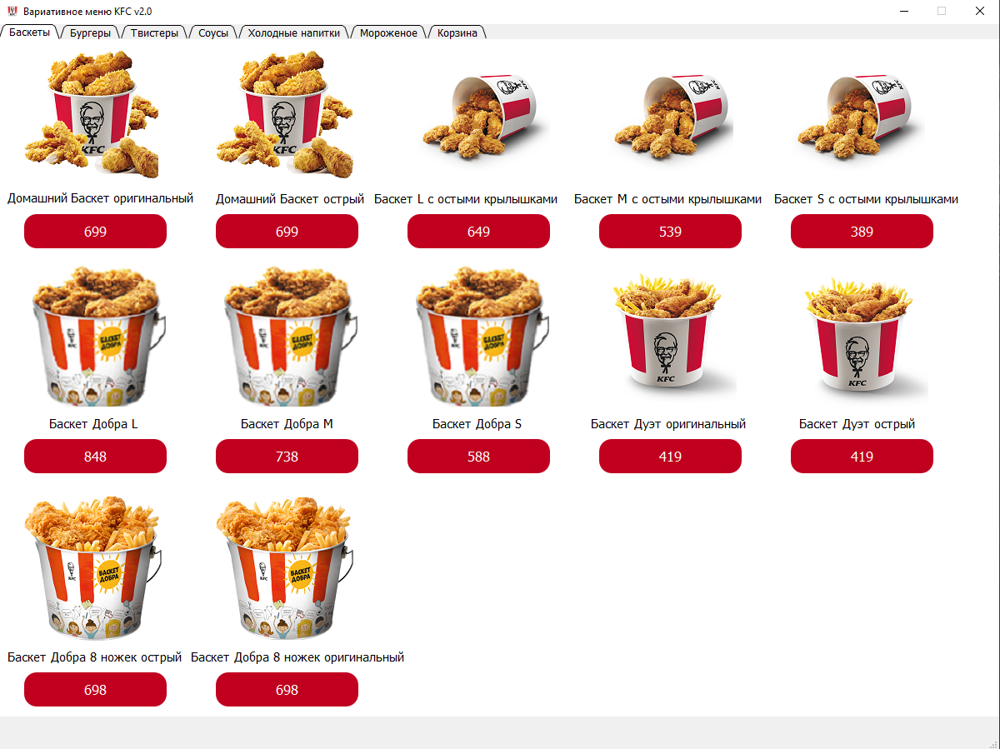

# Информация о проекте

---
## Основная иформация
* **Название:** *Вариативнеое меню KFC v2.0*
* __Создатель:__ Сотников Ярослав Николаевич
### Описание
Мои проект представляет из себя ничто иное, как меню
сети ресторанов быстрого питания __KFC__ (_Kentucky Fried_ 
_Chicken_). Иными словами - это приложение, где вы можете 
сделать заказ на определённую стоимость из разных, доступных в перечне товаров
и возможность посмотреть чек.
### Картинка проекта

### Информация о установленных библиотеках
Вся информация находится в _requirements.txt_
## Как установить программу
1. Скачать архив _"Вариативное меню KFC v2.0.zip"_ и разархивировать его
2. Открыть папку _Вариативное меню KFC v2.0_
3. Открыть файл Вариативное меню KFC v2.exe